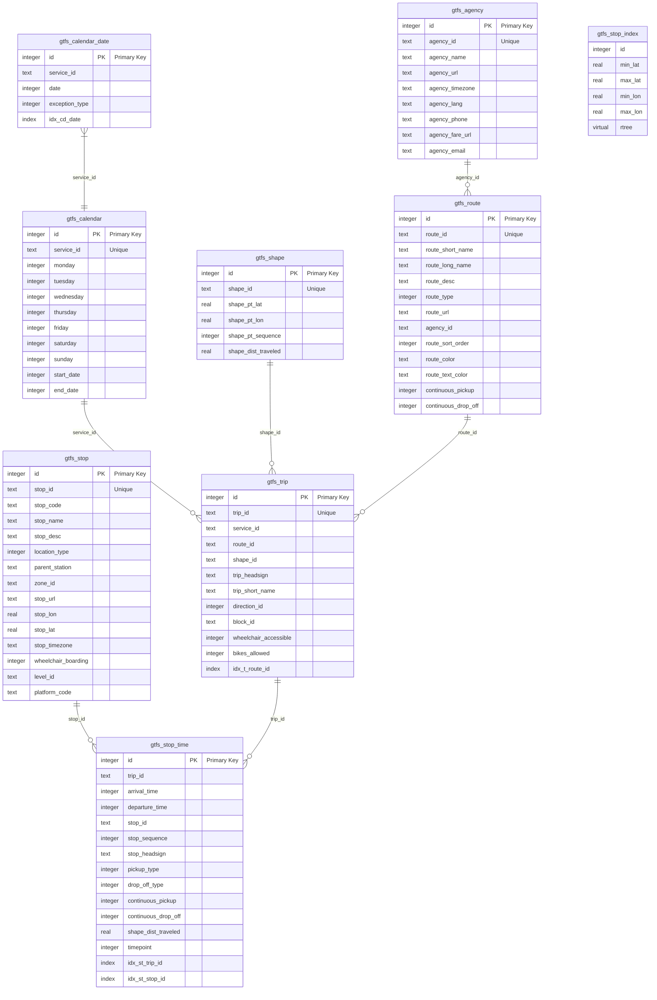

```mermaid
erDiagram
    gtfs_agency {
        integer id PK "Primary Key"
        text agency_id "Unique"
        text agency_name
        text agency_url
        text agency_timezone
        text agency_lang
        text agency_phone
        text agency_fare_url
        text agency_email
    }

    gtfs_calendar {
        integer id PK "Primary Key"
        text service_id "Unique"
        integer monday
        integer tuesday
        integer wednesday
        integer thursday
        integer friday
        integer saturday
        integer sunday
        integer start_date
        integer end_date
    }

    gtfs_calendar_date {
        integer id PK "Primary Key"
        text service_id
        integer date
        integer exception_type
        index idx_cd_date
    }

    gtfs_shape {
        integer id PK "Primary Key"
        text shape_id "Unique"
        real shape_pt_lat
        real shape_pt_lon
        integer shape_pt_sequence
        real shape_dist_traveled
    }

    gtfs_route {
        integer id PK "Primary Key"
        text route_id "Unique"
        text route_short_name
        text route_long_name
        text route_desc
        integer route_type
        text route_url
        text agency_id
        integer route_sort_order
        text route_color
        text route_text_color
        integer continuous_pickup
        integer continuous_drop_off
    }

    gtfs_stop {
        integer id PK "Primary Key"
        text stop_id "Unique"
        text stop_code
        text stop_name
        text stop_desc
        integer location_type
        text parent_station
        text zone_id
        text stop_url
        real stop_lon
        real stop_lat
        text stop_timezone
        integer wheelchair_boarding
        text level_id
        text platform_code
    }

    gtfs_stop_index {
        integer id
        real min_lat
        real max_lat
        real min_lon
        real max_lon
        virtual rtree
    }

    gtfs_stop_time {
        integer id PK "Primary Key"
        text trip_id
        integer arrival_time
        integer departure_time
        text stop_id
        integer stop_sequence
        text stop_headsign
        integer pickup_type
        integer drop_off_type
        integer continuous_pickup
        integer continuous_drop_off
        real shape_dist_traveled
        integer timepoint
        index idx_st_trip_id
        index idx_st_stop_id
    }

    gtfs_trip {
        integer id PK "Primary Key"
        text trip_id "Unique"
        text service_id
        text route_id
        text shape_id
        text trip_headsign
        text trip_short_name
        integer direction_id
        text block_id
        integer wheelchair_accessible
        integer bikes_allowed
        index idx_t_route_id
    }

    gtfs_agency ||--o{ gtfs_route : "agency_id"
    gtfs_calendar ||--o{ gtfs_trip : "service_id"
    gtfs_calendar_date }|--|| gtfs_calendar : "service_id"
    gtfs_shape ||--o{ gtfs_trip : "shape_id"
    gtfs_route ||--o{ gtfs_trip : "route_id"
    gtfs_stop ||--o{ gtfs_stop_time : "stop_id"
    gtfs_trip ||--o{ gtfs_stop_time : "trip_id"


```
